# Rutina en el gym para fortalecer y tonificar los músculos
#### https://mejorconsalud.as.com/rutina-entrenamiento-gimnasio-fortalecer-tonificar-musculos/

<h1> Día 1: Piernas y glúteos </h1>

  
Sentadillas

    <h2>Elige una de las siguientes </h2>
    <table>
        <thead>
            <tr>
                <th>Sentadilla 1</th>
                <th>Sentadilla 2</th>
                <th>Sentadilla 3</th>
            </tr>
        </thead>
        <tbody>
            <tr>
                <td>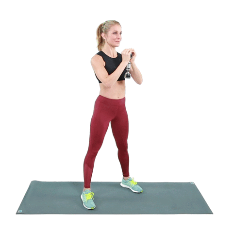</td>
                <td></td>
                <td>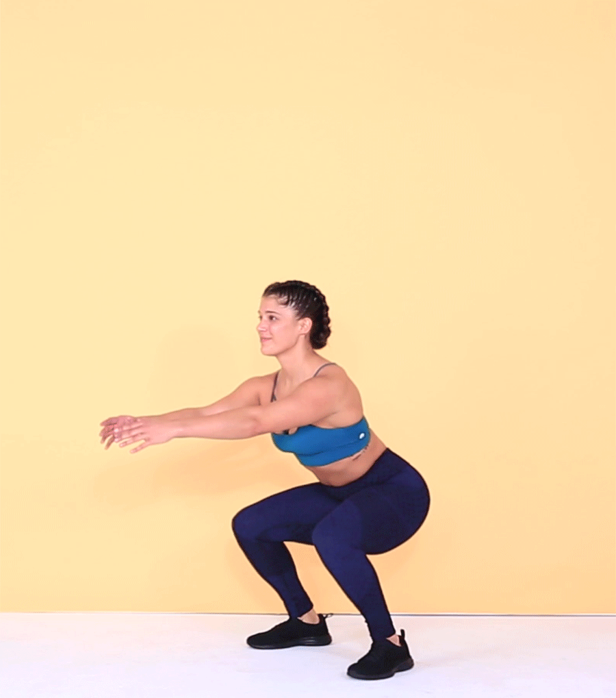</td>
            </tr>
            <tr>
                <td>
                    ¿Cómo hacerlas?
                    <ul>
                        <li>Realiza 3 series de 15 repeticiones.</li>
                    </ul>
                </td>
                <td>
                    ¿Cómo hacerlas?
                    <ul>
                        <li>Sostén la sentadilla durante 3 o 5 segundos.</li>
                        <li>Regresa a la posición inicial y haz 3 series de 15 repeticiones.</li>
                    </ul>
                </td>
                <td>
                    ¿Cómo hacerlas?
                    <ul>
                        <li>Realiza 10 repeticiones 3 series.</li>
                    </ul>
                </td>
            </tr>
        </tbody>
    </table>

  
Curl

    <h2>Elige una de las siguientes </h2>
    <table>
        <thead>
            <tr>
                <th>Curl</th>
            </tr>
        </thead>
        <tbody>
            <tr>
                <td>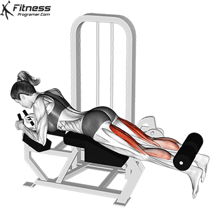</td>
            </tr>
            <tr>
                <td>
                    ¿Cómo hacerlas?
                    <ul>
                        <li>3 series de 10 repeticiones</li>
                    </ul>
                </td>
            </tr>
        </tbody>
    </table>

  
Peso Muerto

    <h2>Elige una de las siguientes </h2>
    <table>
        <thead>
            <tr>
                <th>Peso muerto 1</th>
                <th>Peso muerto 2</th>
            </tr>
        </thead>
        <tbody>
            <tr>
                <td>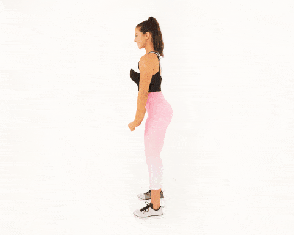</td>
                <td>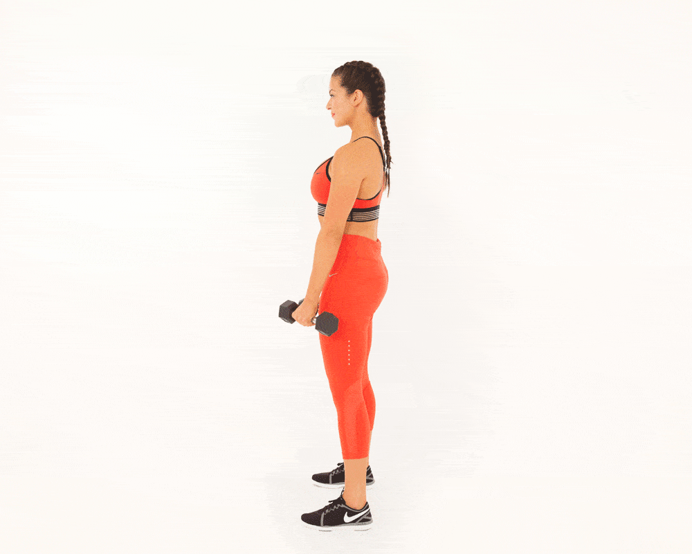</td>
            </tr>
            <tr>
                <td>
                    ¿Cómo hacerlas?
                    <ul>
                        <li>Realiza 3 series de 15 repeticiones.</li>
                    </ul>
                </td>
                <td>
                    ¿Cómo hacerlas?
                    <ul>
                        <li>Realiza 3 series de 15 repeticiones.</li>
                    </ul>
                </td>
            </tr>
        </tbody>
    </table>

  
Zancada

    <h2>Elige una de las siguientes </h2>
    <table>
        <thead>
            <tr>
                <th>Zancada 1</th>
                <th>Zancada 2</th>
            </tr>
        </thead>
        <tbody>
            <tr>
                <td></td>
                <td>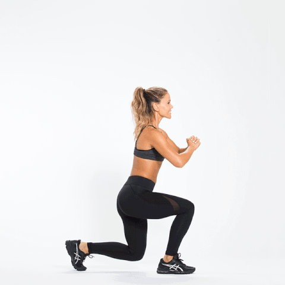</td>
            </tr>
            <tr>
                <td>
                    ¿Cómo hacerlas?
                    <ul>
                        <li>Realiza 3 series de 15 repeticiones.</li>
                    </ul>
                </td>
                <td>
                    ¿Cómo hacerlas?
                    <ul>
                        <li>Realiza 3 series de 10 repeticiones.</li>
                    </ul>
                </td>
            </tr>
        </tbody>
    </table>

  
Abduccion

    <h2>Elige una de las siguientes </h2>
    <table>
        <thead>
            <tr>
                <th>Abduccion 1</th>
                <th>Abduccion 2</th>
            </tr>
        </thead>
        <tbody>
            <tr>
                <td>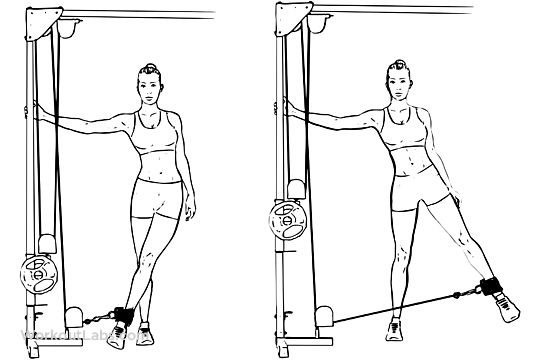</td>
                <td>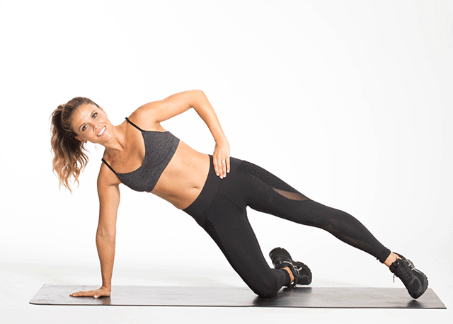</td>
            </tr>
            <tr>
                <td>
                    ¿Cómo hacerlas?
                    <ul>
                        <li>Realiza 3 series de 15 repeticiones.</li>
                    </ul>
                </td>
                <td>
                    ¿Cómo hacerlas?
                    <ul>
                        <li>Realiza 3 series de 15 repeticiones.</li>
                    </ul>
                </td>
            </tr>
        </tbody>
    </table>

  
Caminata en cinta: 10 minutos.

    <h2>Elige una de las siguientes </h2>
    <table>
        <thead>
            <tr>
                <th>Curl</th>
            </tr>
        </thead>
        <tbody>
            <tr>
                <td>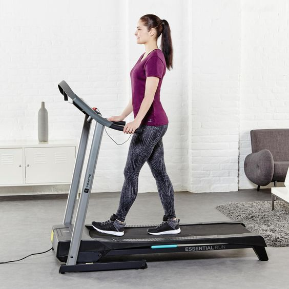</td>
            </tr>
            <tr>
                <td>
                    ¿Cómo hacerlas?
                    <ul>
                        <li>10 minutos.</li>
                    </ul>
                </td>
            </tr>
        </tbody>
    </table>

  
Estiramiento.

    <h2>Elige una de las siguientes </h2>
    <table>
        <thead>
            <tr>
                <th>1</th>
                <th>2</th>
                <th>3</th>
            </tr>
        </thead>
        <tbody>
            <tr>
                <td>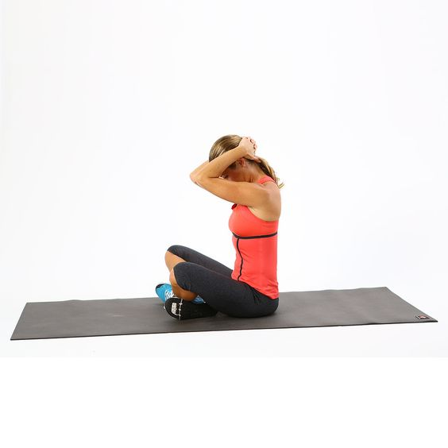</td>
                <td>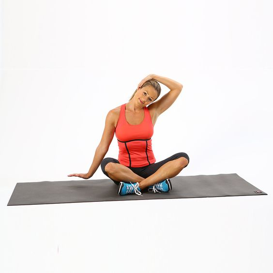</td>
                <td>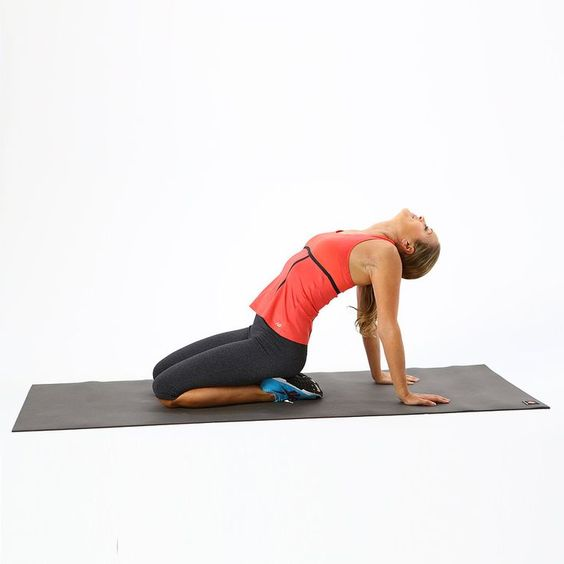</td>
            </tr>
        </tbody>
        <thead>
            <tr>
                <th>4</th>
                <th>5</th>
                <th>6</th>
            </tr>
        </thead>
        <tbody>
            <tr>
                <td>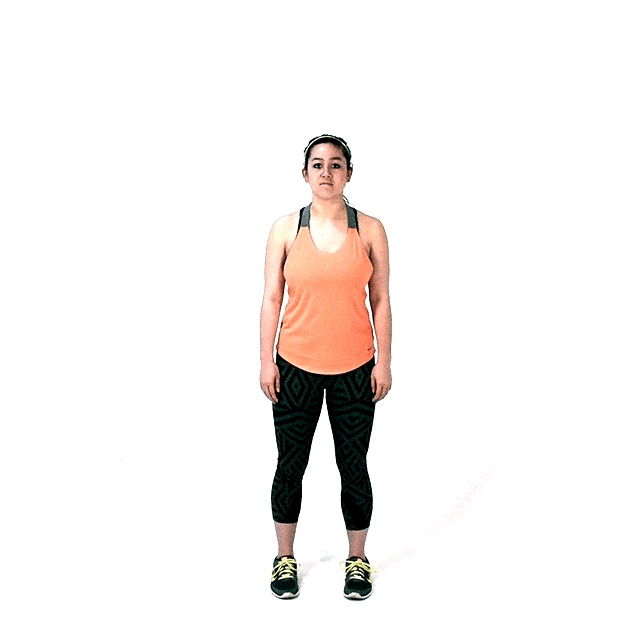</td>
                <td>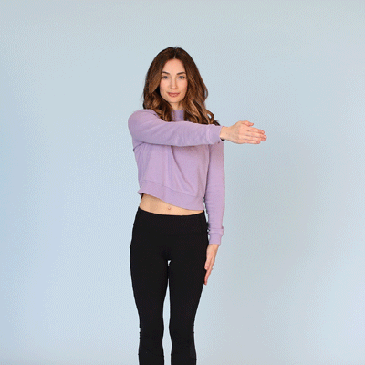</td>
                <td>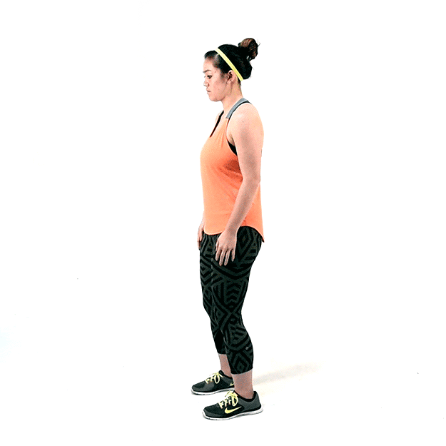</td>
            </tr>
        </tbody>
        <thead>
            <tr>
                <th>7</th>
                <th>8</th>
                <th>9</th>
            </tr>
        </thead>
        <tbody>
            <tr>
                <td>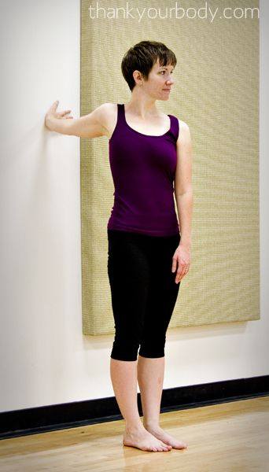</td>
                <td>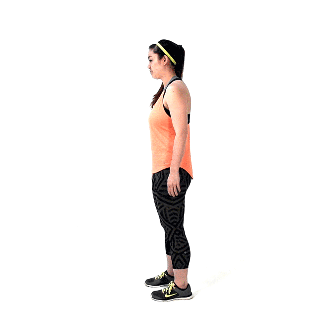</td>
                <td>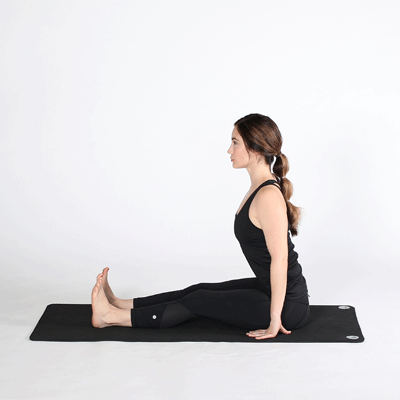</td>
            </tr>
        </tbody>
        <thead>
            <tr>
                <th>10</th>
                <th>11</th>
                <th>12</th>
            </tr>
        </thead>
        <tbody>
            <tr>
                <td>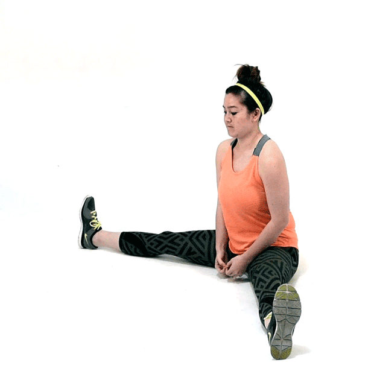</td>
                <td>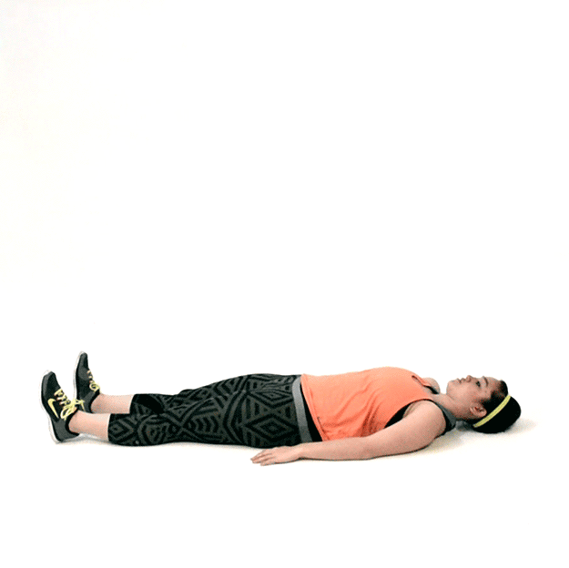</td>
            </tr>
        </tbody>
    </table>

